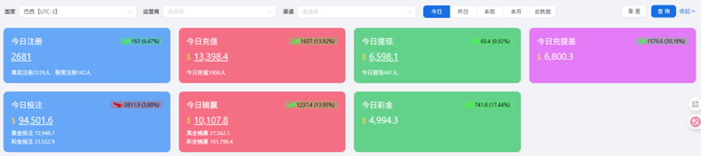

# Dashboard

#### **Data Overview**

<figure><figcaption></figcaption></figure>

**1. Function description**

The dashboard is used to display the core operational data of the platform and help managers grasp the overall situation at the first time. The page is mainly overview, which intuitively reflects the current business operating status and trends.

**2. Filtering and query functions**

<figure><figcaption></figcaption></figure>

This function is used to perform conditional filtering and time query on dashboard data, making it convenient for managers to view data performance in different dimensions as needed.

2.1 Channel screening

You can filter by country, operator, and channel to facilitate analysis of differences in different markets and sources.

2.2 Time frame

Supports selecting today (selecting today will also display the increase and decrease trend with yesterday), yesterday, this week, and this month to quickly obtain data for the corresponding period.

**3.Data description**

<figure><figcaption></figcaption></figure>

Special note 1: The prefix will be changed according to the selected date filter. Taking today's registration as an example, if you select yesterday, it will become yesterday's registration. The following instructions are based on today's data as an example.

Special Note 2: Changes between today and yesterday: As shown below, it will only be displayed when today's data is selected. If today's data is higher than yesterday's data, a green upward arrow will be displayed, indicating that today's data is higher than yesterday's data. Otherwise, a red downward arrow will be displayed, indicating that today's value is lower than yesterday's data. The following value is the difference between today and yesterday's data, and the following percentage is the change percentage = (today-yesterday's difference)/yesterday's value\*100%

<figure><figcaption></figcaption></figure>

3.1 Register today

<figure><figcaption></figcaption></figure>

(1) Today’s registration: The total number of registrations today is the sum of the real number of registrations and the number of fission registrations

(2) Real registration: that is, the number of registrations today excluding fission.

(3) Fission registration: the number of lower-level registrations brought by players

3.2 Recharge today

<figure><figcaption></figcaption></figure>

(1) Today’s recharge: today’s recharge amount

(2) Number of people recharging today: Total number of people recharging today

3.3 Withdraw cash today

<figure><figcaption></figcaption></figure>

(1) Today’s withdrawal: today’s withdrawal amount

(2) Number of people withdrawing money today: Total number of people withdrawing money today

3.4 Re-raise the difference today

<figure><figcaption></figcaption></figure>

(1) Today's re-withdrawal difference: the difference between today's recharge amount - the cash withdrawal amount

3.5 Today’s Betting

<figure><figcaption></figcaption></figure>

(1) Today’s betting: Today’s betting amount, including real money betting and bonus betting

(2) Today’s Betting: Today’s real money betting amount

(3) Today’s Betting: Today’s bonus betting amount (if there is a bonus, priority will be given to spending the bonus to place bets to complete the coding task)

3.6 Today’s win or loss (referring to the profit and loss of the platform)

<figure><figcaption></figcaption></figure>

(1) Today’s win or loss: the total amount of players’ bets - the player’s winnings. A positive number represents the platform’s profit (the overall player loses money), and a negative number represents the platform’s loss (the overall player wins).

(2) Real money winnings and losses: Players’ total real money bets – Players’ winnings and payout

(3) Lottery winnings and losses: player’s total betting amount – player’s winnings

3.7 Today’s bonus

<figure><figcaption></figcaption></figure>

(1) Today’s bonus: the total amount of bonus received by the user (excluding commission amount)

#### Time-sharing data comparison

<figure><figcaption></figcaption></figure>

**1. Function description**

This function is used to conduct comparative analysis of core data of operators and channels by time period (time granularity is half an hour), helping managers gain insight into user activity and fund changes in different time periods.

**2. Filtering and query**

This function is used to perform conditional filtering and time query on time-sharing data, making it convenient for managers to view data performance in different dimensions as needed.

2.1 Channel screening

You can filter by country, operator, and channel to facilitate analysis of differences in different markets and sources.

2.2 User filtering

You can filter by total users, new users, and old users to facilitate analysis of different user types.

2.3 Indicator screening

You can filter by the number of people online, number of registered people, recharge amount, number of rechargers, payment rate, recharge ARPPU (recharge amount/number of rechargers), active ARPU (recharge amount/number of active people), and cash withdrawal amount

2.4 Time filtering

You can press today, yesterday, last 3 days, last 7 days, last week, this month, last month, custom date (select a single day/date range)

#### Distribution of bettors on popular games

<figure><figcaption></figcaption></figure>

**1. Function description**

This function is used to view the distribution pie chart of the number of people placing bets on popular games for operators and channels filtered out in the data overview.

**2.Manufacturer selection**

You can select game manufacturers above, all or a single manufacturer

#### Distribution of game brand bettors

<figure><figcaption></figcaption></figure>

**1. Function description**

This function is used to view the distribution pie chart of the number of people betting on popular game brands (i.e. PG, Ezugi, Evoplay, etc.) from operators and channels selected in the data overview.

**2.Manufacturer selection**

You can select game manufacturers above, all or a single manufacturer
